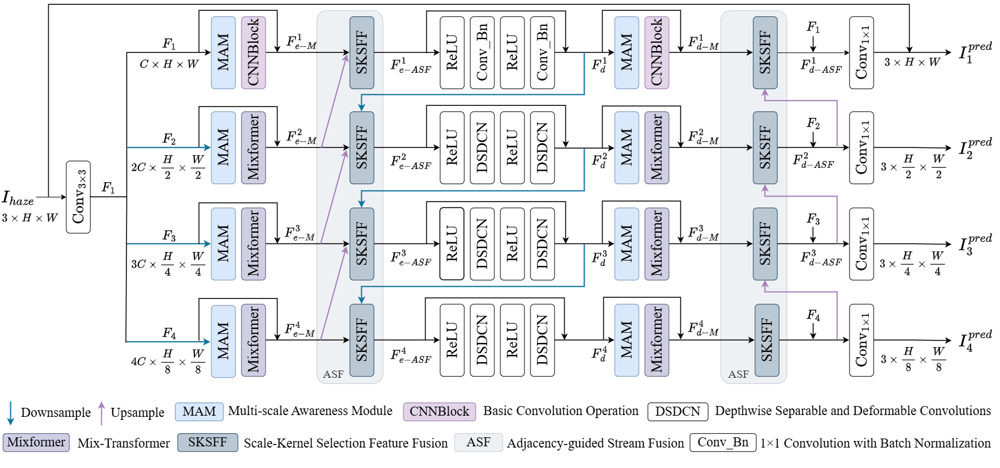

# Multi-Scale Synergetic Lightweight Mix-Transformer for Image Dehazing

## Overview

The overall architecture of the network adopts an end-to-end encoder-decoder structure.

## Preparation

## Prepare pretrained models
We will provide the pre-trained weights as soon as possible.

## Data Preparation
1.Download the dataset:ITS,OTS,Haze4K,DenseHaze,NHHAZE,Snow100K,Deraining

2.Make sure the file structure is consistent with the following:

dataset/
├── Haze4K
│   ├── train
│   │   ├── GT
│   │   └── hazy
│   └── test
│       ├── GT
│       └── hazy
├── ITS
│   ├── train
│   │   ├── GT
│   │   └── hazy
│   └── test
│       ├── GT
│       └── hazy
├── OTS
│   ├── train
│   │   ├── GT
│   │   └── hazy
│   └── test
│       ├── GT
│       └── hazy
├── NHHAZE
│   ├── train
│   │   ├── GT
│   │   └── hazy
│   └── test
│       ├── GT
│       └── hazy
├── DenseHaze
│   ├── train
│   │   ├── GT
│   │   └── hazy
│   └── test
│       ├── GT
│       └── hazy
├── Snow100K
│   ├── train
│   │   ├── GT
│   │   └── snow
│   └── test
│       ├── GT
│       └── snow
└── Deraining
    ├── train
    │   ├── GT
    │   └── rain
    └── test
        ├── GT
        └── rain

